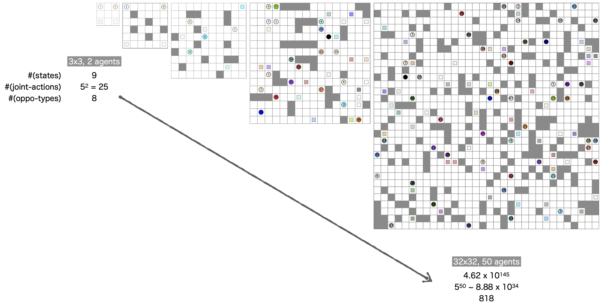
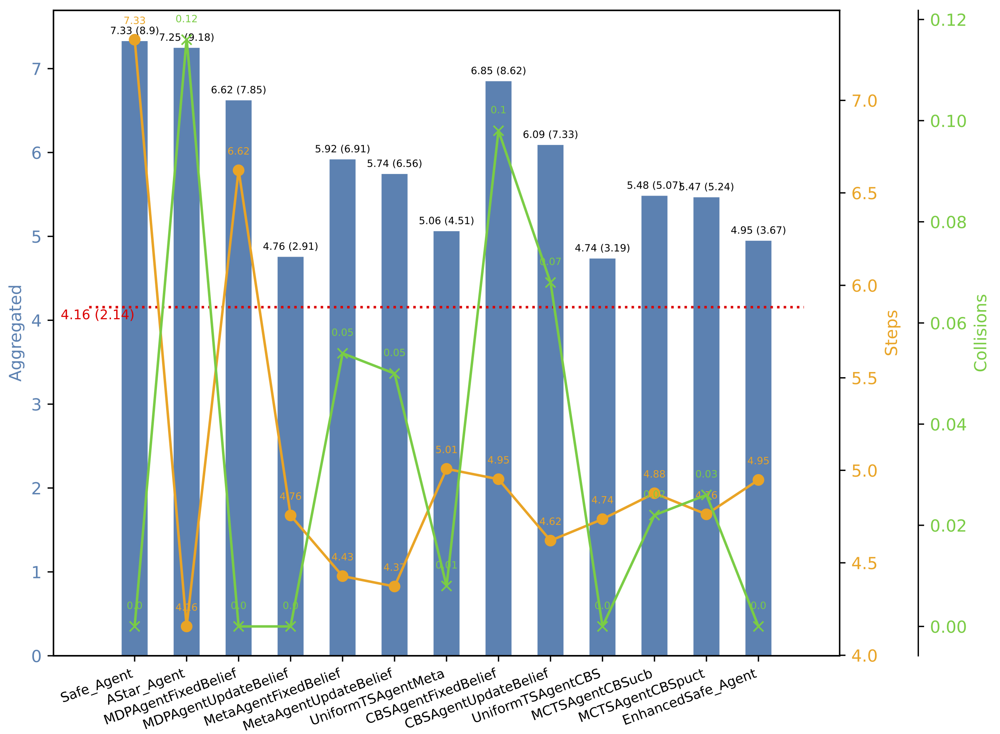

# Single-Agent Planning in a Multi-Agent System



### Intro

The repo implements various planners for controlling one single agent in an environment involving multiple other agents. The controlled agent has very limited prior knowledge about its opponents. Therefore, in principle, this pivotal agent is faced with a trade-off between exploiting its currently accumulated information about the other agents and exploring further to improve future (re-)planning.


### Virtual Environment and Dependency

The whole project is developed under ***Python 3.9.18***

```shell
conda env create BRP python=3.9.18
```

Launch the virtual environment, and install the dependencies

```shell
conda activate BRP
pip install -r requirements.txt
```

One may need to additionally compile the EECBS solver from this repo

- https://github.com/Jiaoyang-Li/EECBS

And download the POMDP solver from this website

- http://www.pomdp.org/code/index.html


### Let's Play!

One can have a quick start by trying the following command,

```shell
python run.py --agents 2 --map small --starts 1_1 1_6 --goals 6_6 6_1 --vis
```

where the `--agent` option specifies the number of agents, the `--map` option specifies the map layout from the `maps/` folder, the `--starts` option specifies the initial location for each agent (so does the `--goal` option), and finally the `--vis` option will render such an animation below,


https://github.com/user-attachments/assets/3a76c2ee-b209-4957-9934-b8fc78d0762e


There will also appear some textual output resembling the following,

```shell
=== Belief(2 -> 1) ===
[[  nan   nan   nan   nan   nan   nan   nan   nan]
 [  nan 0.033 0.033 0.033 0.033 0.033 0.033   nan]
 [  nan 0.033   nan 0.033 0.033 0.033 0.033   nan]
 [  nan 0.033 0.033 0.033   nan 0.033 0.033   nan]
 [  nan 0.033   nan 0.033 0.033 0.033   nan   nan]
 [  nan 0.033 0.033 0.033   nan 0.033 0.033   nan]
 [  nan   nan 0.033 0.033 0.033 0.033 0.033   nan]
 [  nan   nan   nan   nan   nan   nan   nan   nan]]
Step 1: took 3.814697265625e-06s

...

=== Belief(2 -> 1) ===
[[  nan   nan   nan   nan   nan   nan   nan   nan]
 [  nan 0.001 0.001 0.001 0.001 0.003 0.003   nan]
 [  nan 0.001   nan 0.001 0.001 0.003 0.003   nan]
 [  nan 0.001 0.001 0.001   nan 0.003 0.003   nan]
 [  nan 0.001   nan 0.001 0.001 0.003   nan   nan]
 [  nan 0.001 0.001 0.001   nan 0.023 0.023   nan]
 [  nan   nan 0.001 0.001 0.001 0.451 0.451   nan]
 [  nan   nan   nan   nan   nan   nan   nan   nan]]

Detailed trajectory:
T0: start from ((1, 1), (1, 6))
T1: actions: ['down', 'down']	locations: ((2, 1), (2, 6))
...
T10: actions: ['right', 'left']	locations: ((6, 6), (6, 1))
[10. 10.] [0. 0.] False
```

where

1. The matrix represent under the `Belief` section means the belief map that $agent_1$ holds about $agent_2$
2. The trajectory denotes a sequence of joint actions and locations tuples
3. The eventual three elements indicates: i) the number of steps taken by each agent; ii) the number of collisions occurred to each agent; and iii) whether they end up getting stuck (i.e., have stopped for a long duration) 

**For the detailed usage, please enquire by the following command,**

```shell
python run.py --help

usage: run.py [-h] [--agents AGENTS] [--map MAP] [--starts STARTS [STARTS ...]] [--goals GOALS [GOALS ...]] [--vis] [--save SAVE]

Multi-Agent Planning.

optional arguments:
  -h, --help            show this help message and exit
  --agents AGENTS       Specify the number of agents
  --map MAP             Specify a map
  --starts STARTS [STARTS ...]
                        Specify the starts for each agent,e.g. 2_0 0_2, or just `random`
  --goals GOALS [GOALS ...]
                        Specify the goals for each agent,e.g. 2_0 0_2, or just `random`
  --vis                 Visulize the process
  --save SAVE           Specify the path to save the animation
```


### Evaluation

For a comprehensive evaluation, one can consult this shell scrip `run_exp_rand.sh`, a sample command will be as the following,

```shell
python experiments_rand.py --map small --cfg small --agents 2 \
   	--tests 0 1 2 4 5 6 7 8 9 10 11 12 \
  	--prefix exp/small_rand --num-sim 5e2 --oppo-type rational --plot --mp 8
```

This command means the conduct a comprehensive evaluation for all the agents with planner from $type_0$ to $type_{12}$, against a group of rational opponents (see our paper for a more specific definition). The whole evaluation will be paralleled with **8** processes. Upon the completion, it will plot a figure as follows,



**Again, one might as well try the `--help` option to obtain the detailed usage,**

```shell
python experiments_rand.py --help

usage: experiments_rand.py [-h] [--map MAP] [--agents AGENTS] [--cfg CFG] [--tests TESTS [TESTS ...]] [--oppo-type OPPO_TYPE] [--num-sim NUM_SIM] [--size SIZE] [--plot]
                           [--load] [--prefix PREFIX] [--mp MP]

Evaluation.

optional arguments:
  -h, --help            show this help message and exit
  --map MAP             Specify a map
  --agents AGENTS       Specify the number of agents
  --cfg CFG             Specify a parameter configuration
  --tests TESTS [TESTS ...]
                        Specify the type of the controlled agent
  --oppo-type OPPO_TYPE
                        Specify the type of opponents among [malicous, rational, evolving]
  --num-sim NUM_SIM     Specify the number of tesing simulations
  --size SIZE           Specify the figsize
  --plot                Plot the experimental results
  --load                Load the existing experimental results
  --prefix PREFIX       Specify the prefix of exp_file loading
  --mp MP               Specify the number of multiprocessing
```


### Implemented Planners

We implemented quite many planners, as summarized in the table below. We evaluated some of them and reported a few empirical results in our paper. We now show you how to play with them in detail.

| Planners Class           | Belief update |  Planning space  | Behavior            |
| ------------------------ | :-----------: | :--------------: | ------------------- |
| `AStarAgent`             |               |                  | Search-based        |
| `DijkstraAgent`          |               |                  | Search-based        |
| `MDPAgent`               |       ✔️       |      States      | Reward-incentivized |
| `QMDPAgent`              |       ✔️       |      States      | Reward-incentivized |
| `POMDPAgent`             |       ✔️       | States & Beliefs | Reward-incentivized |
| `HistoryMDPAgent`        |       ✔️       | States & Beliefs | Reward-incentivized |
| `MetaAgent`              |       ✔️       | States & Beliefs | Reward-incentivized |
| `CBSAgent`               |       ✔️       |                  | Constraint-based    |
| `UniformTreeSearchAgent` |       ✔️       | States & Beliefs | Hybrid              |
| `AsymmetricTreeSearch`   |       ✔️       | States & Beliefs | Hybrid              |
| `SafeAgent`              |               |      States      | Constraint-based    |
| `EnhancedSafeAgent`      |               |      States      | Constraint-based    |
| `RandomAgent`            |               |                  | Random up to prob.  |
| `ChasingAgent`           |               |                  | Chase others        |

As each planner will be associated with a distinct set of arguments, so we recommend a user to directly specify the desired agents within `run.py`. We have listed a few exemplars at round **Line 80** onwards,

```python
"""
Agent 0
"""
agents.append(AStarAgent(0, args.goals[0]))
# agents.append(MDPAgent(0, args.goals[0], belief_update=True, verbose=True))
# agents.append(MetaAgent(0, args.goals[0], belief_update=True, verbose=False,
#                         meta_policy=meta_square))  # `meta_small` or `meta_square`

"""
Agent 1
"""
# agents.append(AStarAgent(1, args.goals[1]))
# agents.append(RandomAgent(1, args.goals[1], p=0.8))
agents.append(MDPAgent(1, args.goals[1], belief_update=True, verbose=True))

"""
The rest: assume A-star by default
"""
for i in range(2, args.agents):
    agents.append(AStarAgent(i, args.goals[i]))
```

Most of the planner classes share some generic arguments. By specify the following, one can almost specify any customized planner.

| Argument (generic) | Meaning                                                      |
| ------------------ | ------------------------------------------------------------ |
| `label`            | Integer ID of this agent                                     |
| `goal`             | Pre-specified goal location                                  |
| `belief_update`    | Whether to conduct belief update                             |
| `soft_update`      | Smoothness ratio while updating beliefs                      |
| `verbose`          | If set to `True`, detailed belief maps and some time bars will appear |

For advanced agents, e.g., tree-search-based ones `UniformTreeSearch` or `AsymmetricTreeSearch` (belief-incorporated MCTS), one needs to specify a few more arguments,

| Argument (advanced) | Meaning                                                      |
| ------------------- | ------------------------------------------------------------ |
| `depth`             | Depth of tree search                                         |
| `node_eval`         | Evaluation method for leaf nodes, including `IMMED` (immediate reward), `MDP` (construct an MDP at each leaf node), `HEU` (approximate by a heuristic function), `NN` (via a learned policy), `CBS` (perform several conflict-based search) |
| `sample_eval`       | Number of evaluations at each leaf node                      |
| `sample_backup`     | Number of stochastic backups performed for each parent node; or compute the exact expectation if set to 0 |
| `max_it`            | Number of MCTS simulations                                   |
| `sample_select`     | Number of stochastic selection at each `EXP` node            |
| `pUCB`              | If set to `True`, use the `pUCB` formula; otherwise, use the vanilla `UCB` formula |

We present one demo of our result using belief-incorporated MCTS with CBS as its node evolution (a hybrid approach combining reward-incentivized and constraint-based modules). In this example, the controlled agent is with ID **1**.


https://github.com/user-attachments/assets/cdbd92f8-0df2-4c88-8006-71bc8455a028


---

***Feel free to open an issue or pull-request. Have fun!***

